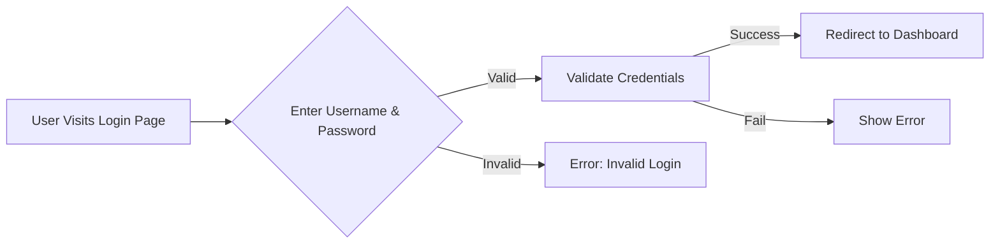

# **DayaGramAI** 🛠️✨  
An **AI-powered** tool that generates **flowcharts, sequence diagrams, class diagrams, user journeys, Gantt charts, and C4 diagrams** from **natural language prompts** using **Mermaid.js**.  

Built with **FastAPI** for the backend, **Groq's Llama-3.3-70B-Versatile** model for AI-powered diagram generation, and **Mermaid.js** for real-time rendering.

---

## **🚀 Features**
- Converts **natural language descriptions** into **Mermaid.js diagrams**.
- Supports **flowcharts, Gantt charts, sequence diagrams, and more**.
- Uses **Groq's Llama-3.3-70B-Versatile** LLM to generate accurate Mermaid.js code.
- Built using **FastAPI** for the backend and **Vanilla JavaScript** for the frontend.
- **Real-time rendering** with Mermaid.js.

---

## **🛠️ How It Works**
### **1️⃣ User Input**
- The user enters a **natural language prompt** in the input field.  
- Example:  
  ```
  Generate a flowchart for a website login system.
  ```

### **2️⃣ Frontend Sends Request to Backend**
- The **frontend** (JavaScript) sends a **POST request** to the FastAPI backend at `http://127.0.0.1:8000/generate`.
- The request contains the **user’s prompt**.

### **3️⃣ Backend Processes the Request**
- The **FastAPI backend** receives the request and forwards the prompt to **Groq’s Llama-3.3-70B-Versatile model**.
- The AI **interprets the request** and generates a valid **Mermaid.js code snippet**.
- The **backend extracts the Mermaid.js code** and sends it back to the frontend.

### **4️⃣ Frontend Renders the Diagram**
- The **frontend JavaScript** receives the generated **Mermaid.js code**.
- It **updates the webpage**, inserting the Mermaid.js code into the diagram container.
- **Mermaid.js initializes and renders the diagram in real time.**

---

## **📂 Project Structure**
```
📦 DayaGramAI
 ┣ 📂 frontend
 ┃ ┣ 📜 index.html       # Main frontend UI
 ┃ ┣ 📜 styles.css       # UI styling
 ┃ ┣ 📜 script.js        # Handles API calls & Mermaid.js rendering
 ┣ 📜 server.py          # FastAPI backend that interacts with Groq API
 ┣ 📜 .env.example       # Example environment variable file
 ┣ 📜 README.md          # Project documentation
 ┣ 📜 requirements.txt    # Python dependencies
 ┗ 📜 .gitignore         # Ignores sensitive files
```

---

## **🌟 Setup Guide**
Follow these steps to **install** and **run** DayaGramAI on your local machine:

### **1️⃣ Clone the Repository**
```bash
git clone https://github.com/bandym05/DayaGramAI-AI-Diagram-Generator.git
cd DayaGramAI
```

### **2️⃣ Set Up the Backend**
Ensure you have **Python 3.8+** installed.

```bash
# Create a virtual environment (optional but recommended)
python -m venv venv
source venv/bin/activate  # On macOS/Linux
venv\Scripts\activate     # On Windows

# Install dependencies
pip install -r requirements.txt
```

### **3️⃣ Configure the API Key**
- Rename `.env.example` to `.env`
- Add your **Groq API Key** inside the `.env` file:
  ```
  GROQ_API_KEY=your-groq-api-key
  ```

### **4️⃣ Run the Backend Server**
```bash
uvicorn server:app --reload --port 8000
```
Your **FastAPI backend** will now be running on **`http://127.0.0.1:8000`** 🎉

### **5️⃣ Run the Frontend**
Simply open **`frontend/index.html`** in your **browser**.

---

## **🖼️ Usage Guide**
1. **Enter a prompt** describing your desired diagram.  
   Example:  
   ```
   Generate a flow diagram for a website login process.
   ```
2. **Click "Generate Diagram"**, and the AI will return a Mermaid.js diagram.  
3. The diagram is **rendered in real-time** in the UI.

---

## **💡 Example Output**
### **User Prompt:**  
```
Generate a flow diagram for a website login page.
```

### **Generated Mermaid.js Code:**

### **Rendered Output:**  
When this code is passed into Mermaid.js, it creates a **visual flowchart** directly in the browser.

---

## **🚀 Future Improvements**
✅ **Export diagrams** as PNG/SVG.  
✅ **Improve UI/UX** with a modern design.  
✅ **Deploy backend on a cloud server** for public access.  
✅ **Add support for more complex diagrams**.  

---

## **📝 License**
This project is **open-source** under the **MIT License**.  

---

## **🤝 Contributing**
Want to improve FlowchatAI? Feel free to **fork** and **contribute**! 🚀  

---

## **📬 Contact**
For feedback or inquiries, reach out via:  
📧 **Email:** bandymalaza05@gmail.com  
🔗 **LinkedIn:** [Your Profile](https://www.linkedin.com/in/bandile-malaza-932a7718a/)  

